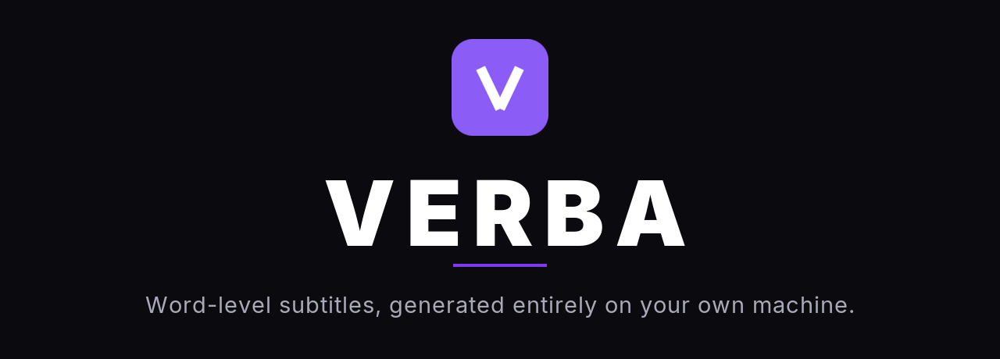

<p align="center">
  
</p>

<p align="center">
  <a href="https://github.com/Zerflyne/verba/actions/workflows/verifica.yml"></a>
  <a href="https://github.com/Zerflyne/verba/releases/latest"></a>
  <a href="LICENSE"></a>
  
  
</p>

<h1 align="center">Subtitles that know where every word begins</h1>

<p align="center">
  Verba takes an audio or video file, transcribes it with <b>per-word timings</b>,<br>
  and gives you the subtitles back as text, as a burned-in video,<br>
  or as a transparent overlay you can drop onto any timeline.
</p>

<p align="center">
  <b>Nothing leaves your computer.</b> No upload, no account, no subscription,<br>
  no per-minute quota. That is the whole reason it exists.
</p>

---


## Contents

- [What you get](#what-you-get)
- [Install](#install) — **[Linux](#linux-deb) · [Windows](#windows-exe) · [macOS](#macos-dmg)**
- [First run: the models](#first-run-the-models)
- [Using the app](#using-the-app)
- [Using the command line](#using-the-command-line)
- [Options](#options)
- [Build from source](#build-from-source)
- [Known limitations](#known-limitations)
- [How it works](#how-it-works)
- [Development](#development)
- [License](#license)

> [!NOTE]
> **The interface and the documentation are in Italian.** Verba was built in
> Italian, by an Italian author, tuned on Italian speech — the menus, the log
> messages and the `docs/` folder all reflect that. This README is the English
> way in. Other languages transcribe fine; see [Known
> limitations](#known-limitations) for what that does and does not mean.

## What you get

| Stage | Model | Runtime |
|---|---|---|
| Pre-processing | — | Symphonia + rubato, entirely in RAM |
| Segmentation | `pyannote/segmentation-3.0` | ONNX Runtime |
| Transcription | `whisper` large-v3 / medium / small | whisper.cpp (GGML) |
| Alignment | `wav2vec2` Italian (CTC) | ONNX Runtime |
| Typesetting | — | cosmic-text, one to three lines |
| Drawing | — | RGBA with alpha: text plus the active-word highlight |
| Encoding | — | libavcodec / libavformat (C++) |
| Output | — | `.mp4` `.mov` `.webm` `.srt` `.vtt` `.json` `.txt` |

Nothing is written to a temporary file between those stages. The transcript
stays in memory and feeds typesetting and frame drawing directly.

**Three things you can ask for**, in the app or on the command line:

| | Produces |
|---|---|
| **Transcribe** | subtitles as text: `.srt`, `.vtt`, `.json` (word by word), `.txt` |
| **Render** | your original video with the subtitles **burned in** |
| **Overlay** | the subtitles alone on a **transparent background**, to composite elsewhere |

An audio-only file is treated exactly like a video: the preview shows the
subtitles on black, and export still offers every video format that preserves
background transparency.

## Install

Packaged builds are attached to each
[release](https://github.com/Zerflyne/verba/releases). Pick your platform
below. If you would rather compile it yourself, skip to [Build from
source](#build-from-source).

> [!IMPORTANT]
> **The first launch downloads about 3 GB of models.** They do not fit inside
> the executable and never will — Whisper large-v3 alone is 2.9 GB. See [First
> run](#first-run-the-models).

### Linux (.deb)

For Debian and Ubuntu:

```bash
sudo dpkg -i verba_0.1.0_amd64.deb
sudo apt-get install -f        # only if dpkg reports missing dependencies
```

For every other distribution, the AppImage needs no installation at all:

```bash
chmod +x Verba_0.1.0_amd64.AppImage
./Verba_0.1.0_amd64.AppImage
```

Both packages carry their own copy of ONNX Runtime, so there is nothing else to
fetch. The command-line binary `verba` ships in the same release if you want it
on your `PATH`.

### Windows (.exe)

Run the installer and follow it through.

> [!WARNING]
> **The installer is not code-signed**, so SmartScreen will say *"Windows
> protected your PC"*. A signing certificate costs several hundred euros a year
> and is not justifiable for a project at this stage. To continue: click **More
> info**, then **Run anyway**.
>
> If no warning appears and the file simply vanishes, Defender quarantined it —
> restore it from **Protection history**.

### macOS (.dmg)

Open the disk image and drag Verba into Applications.

> [!NOTE]
> **The macOS package is built but has never been run.** There is no Apple
> machine behind this project: CI produces the `.dmg`, nothing more. It is the
> one platform where a report of what actually happens would be genuinely
> useful — [open an issue](https://github.com/Zerflyne/verba/issues) either
> way.

> [!WARNING]
> **The app is not notarized**, so Gatekeeper will refuse it on the first
> launch. Right-click the app and choose **Open**, then confirm — this is the
> documented way to run unnotarized software and only has to be done once. If
> macOS still refuses, clear the quarantine flag:
>
> ```bash
> xattr -dr com.apple.quarantine /Applications/Verba.app
> ```

## First run: the models

Verba needs four model files. It will offer to fetch them for you on the Load
screen; on the command line, `verba modelli --scarica` does the same. Every
file is checked against the SHA-256 published by its source repository, and an
interrupted download **resumes** where it stopped.

They live in your user data folder:

| System | Folder |
|---|---|
| Linux | `$XDG_DATA_HOME/verba/models`, otherwise `~/.local/share/verba/models` |
| Windows | `%LOCALAPPDATA%\verba\models` |
| macOS | `~/Library/Application Support/verba/models` |

`VERBA_DATA_DIR` overrides that globally, `--cartella-modelli` for a single
command. If you are working inside the repository and the models are in
`./models`, Verba uses those without asking.

**Pick a size to match your machine:**

| Size | Disk | Memory | Speed |
|---|---|---|---|
| `large-v3` (default) | 2.9 GB | ~4.3 GB | the quality benchmark; slow on CPU |
| `medium` | 1.4 GB | ~2.2 GB | roughly twice as fast, loses the odd proper noun |
| `small` | 465 MB | ~1 GB | four to five times faster; fine for a draft or a modest machine |

> [!NOTE]
> **One model has to be exported by hand, once.** Three of the four download
> themselves. The fourth — Italian wav2vec2 in ONNX, the one that gives every
> single word its exact timing — has no public build worth trusting, so you
> produce it yourself:
>
> ```bash
> pip install "torch>=2.2" onnx transformers huggingface_hub
> python scripts/export_models.py --w2v
> mv wav2vec2-italian.onnx wav2vec2-italian.vocab.json ~/.local/share/verba/models/
> ```
>
> The source model is `jonatasgrosman/wav2vec2-large-xlsr-53-italian`; pass
> `--w2v-model` to use a different one. Without it, transcription still works —
> you lose per-word timing, which is the point of Verba, so it is worth the five
> minutes.

## Using the app

Four screens, in the order you actually need them.

| | |
|---|---|
| **Load** — drop a file, watch the stages, check the words |  |
| **Edit** — font, colours, highlight, position, timing; the preview updates within a frame |  |
| **Export** — pick a format; the ones that cannot work for your source are explained, not hidden |  |
| **Settings** — model size, GPU, threads, known terms |  |

Nothing in **Edit** re-runs a model. Every change applies to the preview within
a frame, because the transcript is already in memory.

Two things worth knowing before you start:

- **Known terms are worth setting first.** Names, acronyms and jargon go into a
  CSV that seeds Whisper's initial prompt. The editor is reachable from Settings
  *and* from the Load screen before you choose a file, because applying them
  afterwards means transcribing again.
- **One subtitle line is the default**, not two. More than one line at a time
  makes the result busy; the control is there if you disagree.

## Using the command line

The same engine, three commands:

```bash
verba trascrivi speech.mp3  --out subtitles.srt --lingua it --termini glossary.csv
verba rendi     movie.mp4   --out movie_sub.mp4 --preset horizontal.json
verba overlay   movie.mp4   --out overlay.mov   --preset vertical.json
```

**You never declare the format** — the extension of `--out` decides it:

| Command | Extension | Output |
|---|---|---|
| `trascrivi` | `.srt` | one block per displayed line |
| | `.vtt` | the same, for the web |
| | `.json` | word by word: text, start, end, confidence |
| | `.txt` | text only |
| `rendi` | `.mp4` | H.264 CRF 18, `yuv420p` — plays anywhere |
| | `.mov` | ProRes 422 HQ — lossless, for re-editing |
| `overlay` | `.mov` | ProRes 4444, `yuva444p10le` |
| | `.webm` | VP9 with alpha — far smaller, slower to encode |

Several text formats in a single pass, transcribing only once:

```bash
verba trascrivi interview.m4a --out sub.srt --out sub.vtt --out words.json --out text.txt
```

Three more commands just report what is available: `verba caratteri` (fonts),
`verba preset`, `verba formati`. And `verba modelli` manages the models.

`--json` on any command turns progress into one JSON object per line on stderr,
ready to pipe into something else. Logs go to stderr too; stdout carries only
what the command was asked to produce.

## Options

`verba <command> --help` lists them all, grouped. The ones you will reach for
first:

**Text and position**

| Option | Default | What it does |
|---|---|---|
| `--carattere` | `Inter` | font family; `verba caratteri` lists what is available |
| `--font FILE` | — | a specific `.ttf` or `.otf`, without installing it |
| `--dimensione-font` | 6.5 % of the shorter side | size in pixels, relative to frame height |
| `--formato 9:16\|16:9\|dal-sorgente` | `dal-sorgente` | frame aspect ratio |
| `--righe-massime 1\|2\|3` | `1` | lines shown at once |
| `--posizione alto\|centro\|basso` | — | named form of `--posizione-verticale` (18 %, 50 %, 82 %) |
| `--margine` | `0.05` | minimum distance from the edges; a hard limit |

**Style**

| Option | Default | What it does |
|---|---|---|
| `--colore` | `#FFFFFF` | text colour, `#RRGGBB` or `#RRGGBBAA` |
| `--evidenziazione rettangolo\|sottolineatura\|solo-colore\|nessuna` | `rettangolo` | how the active word is marked |
| `--colore-evidenziazione` | `#7C3AED` | colour of that shape |
| `--bordo` | `0.0` | text outline thickness in pixels |
| `--senza-ombra` | off | turns off the drop shadow, which is on by default |

**Timing**

| Option | Default | What it does |
|---|---|---|
| `--anticipo` | `0.06` | how far the highlight leads the word, in seconds |
| `--pausa-massima` | `0.60` | caps how long a highlight stays lit through silence |
| `--durata-blocco` | `5.0` | maximum length of one block, in seconds |

**Models and hardware**

| Option | Default | What it does |
|---|---|---|
| `--modello large-v3\|medium\|small` | `large-v3` | transcription model size |
| `--lingua` | auto | language code, e.g. `it`, `en` |
| `--termini FILE` | — | known-terms CSV feeding the initial prompt |
| `--gpu` | auto | which GPU to use |
| `--thread` | cores | CPU threads |

The English names used before are still accepted as aliases, so older scripts
keep working.

### Seeding the transcription with known terms

Whisper accepts a piece of context that notionally precedes the audio — the
official way to steer it toward proper nouns, acronyms and technical terms. Put
them in a CSV:

```csv
term,category,notes
Anthropic,company,
Claude Opus,model,
wav2vec2,technical,CTC aligner
"Milan, Italy",place,example with a comma inside the term
```

```bash
verba trascrivi speech.mp3 --termini glossary.csv
```

The parser is deliberately forgiving: header or no header, any column order,
quoted commas, comment lines. Get the terms in and it will work out the rest.

## Build from source

### Prerequisites

```bash
sudo apt install build-essential cmake clang libclang-dev pkg-config \
                 libavcodec-dev libavformat-dev libavutil-dev
```

`cmake` builds whisper.cpp, `clang` is needed by bindgen, and the `libav*`
headers are for the video encoder in `cpp/`. If the headers are not installed
system-wide, point at them directly:

```bash
FFMPEG_INCLUDE_DIR=/path/include FFMPEG_LIB_DIR=/path/lib cargo build --release
```

If bindgen cannot find `stdbool.h` — which happens with a clang that lacks its
own system headers:

```bash
export BINDGEN_EXTRA_CLANG_ARGS="-I$(dirname $(find /usr/lib/gcc -name stdbool.h | head -1))"
```

### ONNX Runtime

The `ort` crate is configured as `load-dynamic`: the library is loaded at
runtime, so you are free to choose the CPU or the GPU build.

```bash
# official GPU build (CUDA 12 + cuDNN 9)
wget https://github.com/microsoft/onnxruntime/releases/download/v1.22.0/onnxruntime-linux-x64-gpu-1.22.0.tgz
tar xf onnxruntime-linux-x64-gpu-1.22.0.tgz
mkdir -p ~/.local/share/verba/lib
cp onnxruntime-linux-x64-gpu-1.22.0/lib/libonnxruntime*.so* ~/.local/share/verba/lib/
```

Verba looks for it on its own, in this order: `ORT_DYLIB_PATH`, the executable's
own folder (plus `lib/` and `../lib/`), `~/.local/share/verba/lib`, then the
system folders. The environment variable exists only to override everything
else — a `.deb` or an AppImage carries the library and needs none of this.

**The version is pinned**: `ort 2.0.0-rc.10` reads `GetVersionString` at startup
and accepts only 1.22.x.

<details>
<summary><b>CUDA libraries at runtime</b> — why it might silently fall back to CPU</summary>

`libonnxruntime_providers_cuda.so` does not carry the CUDA libraries with it; it
looks them up through `LD_LIBRARY_PATH`. Besides `cudart`, `cublas` and `cudnn`
it also needs `curand`, `cufft` and `nvrtc`. If even one is missing the CUDA
provider fails to register, and Verba **falls back to CPU without stopping** —
and says so in the log:

```
WARN CUDA non utilizzabile per ONNX Runtime: si continua su CPU
     (piu' lento, stesso risultato) errore=... libcublasLt.so.12: cannot open ...
```

To check before launching (no output means you are fine):

```bash
ldd ~/.local/share/verba/lib/libonnxruntime_providers_cuda.so | grep "not found"
```

If there is no CUDA toolkit on the system, the libraries from a Python
environment with PyTorch work perfectly well:

```bash
NV=/path/venv/lib/python3.12/site-packages/nvidia
export LD_LIBRARY_PATH="$(find "$NV" -maxdepth 2 -type d -name lib -printf '%p:' | sed 's/:$//')${LD_LIBRARY_PATH:+:$LD_LIBRARY_PATH}"
```

</details>

### Build

```bash
cargo build --release                     # CPU only
cargo build --release --features vulkan   # Whisper on GPU via Vulkan
cargo build --release --features cuda     # Whisper on GPU via CUDA
```

Those features affect **Whisper only**. ONNX Runtime takes the GPU with no extra
feature; it just needs a GPU build of the library.

| | Requires | Notes |
|---|---|---|
| `cuda` | CUDA toolkit with `nvcc` (2–3 GB) | Fastest. whisper.cpp compiles the kernels at build time. |
| `vulkan` | `libvulkan-dev` and `glslc` (~50 MB) | Slower than CUDA, far faster than CPU. Works on cards recent toolkits have dropped (Tesla P40, compute 6.1). |

```bash
sudo apt install libvulkan-dev glslc     # for --features vulkan
```

whisper.cpp with Vulkan enumerates devices by itself and does not follow
`--gpu`. If it picks the wrong card, force it with `GGML_VK_VISIBLE_DEVICES=0`.

### The desktop app

`cargo build --release` compiles **only the engine and the command line**. The
windowed app is deliberately not a default workspace member: dragging in GTK,
WebKit and D-Bus to build a CLI would be an unjustified toll, and on a machine
without those libraries `cargo build` would fail even for someone who has no use
for the window.

On Debian and Ubuntu you need:

```bash
sudo apt install libwebkit2gtk-4.1-dev libgtk-3-dev \
                 libayatana-appindicator3-dev librsvg2-dev \
                 libdbus-1-dev patchelf
```

Then:

```bash
npm install --prefix ui
cargo install tauri-cli --version "^2"                          # once
cargo tauri dev   --config crates/verba-app/tauri.conf.json     # development
cargo tauri build --config crates/verba-app/tauri.conf.json     # .deb, .AppImage
```

`cargo tauri` is **not** a cargo subcommand — it is a separate binary, and it is
only needed for packaging. To build the executable alone:

```bash
npm run build --prefix ui && cargo build -p verba-app --release
```

A release binary embeds `ui/dist` and starts on its own. A **debug** binary
instead loads the interface from `http://localhost:5173`, so start
`npm run dev --prefix ui` first or the window opens on *Connection refused*.

### The interface on its own

```bash
npm run dev --prefix ui        # http://localhost:5173
```

Outside Tauri the bridge to the engine answers with mock data
(`ui/src/banco.ts`): no file is read or written, and the console says so
plainly. It exists so you can work on the look without recompiling the engine
for every CSS change, and to see the window on a machine that has no WebKit.

## Known limitations

- **It works without a GPU**, but large-v3 on CPU is slow — count minutes, not
  seconds, per minute of audio. `--modello small` is four to five times faster
  and loses the odd proper noun.
- **The first launch downloads about 3 GB** of models. They cannot live inside
  the executable.
- **The aligner must be exported by hand**, once, with a Python script. There is
  no public ONNX build of that model worth trusting.
- **Italian is the language it was tuned on.** Others transcribe fine, but the
  default aligner is Italian, so per-word timing is at its best in Italian.
- **The interface is in Italian**, and so is `docs/`.
- **The app window is a fixed 1600×980**, by choice.
- The Windows installer is **not signed** and the macOS app is **not
  notarized** — see [Install](#install) for how to get past the warnings.

## How it works

<details>
<summary><b>Memory: two models, one card</b></summary>

On a machine with little memory the models are never resident together: each
stage loads its own and releases it before the next. In particular **Whisper is
explicitly unloaded from the GPU before the aligner is loaded**
(`Transcriber::release()`).

Where memory is plentiful that relay is just wasted time, and Verba measures
rather than guesses: if free memory exceeds the estimated sum of the two models
by **20 %**, both stay loaded. The estimate, the threshold and the measured
figure all go into the log, along with VRAM usage before and after each unload —
so which path was taken is something you read, not something you deduce.

</details>

<details>
<summary><b>Where per-word timings come from</b></summary>

Whisper gives segment-level timings that are good but not frame-accurate. The
exact boundary of each word comes from a second pass: a CTC aligner (wav2vec2)
run over the same audio, with Viterbi decoding in Rust matching the transcript
against the acoustic frames.

That is why the aligner matters, and why it is worth exporting by hand. The
full account, with the invariants the sequence has to satisfy, is in
[`docs/tempi.md`](docs/tempi.md) (Italian).

</details>

<details>
<summary><b>Layout and drawing</b></summary>

Typesetting is done by cosmic-text against the real font metrics, so a line that
fits in the preview fits in the export — they run the same code. Frames are
drawn as RGBA with a genuine alpha channel, which is what makes the transparent
overlay possible, and the highlight rectangle is drawn behind the glyphs so the
text keeps its own colour.

</details>

The deeper documentation lives in `docs/`, in Italian:
[`spec.md`](docs/spec.md) (the specification),
[`piano.md`](docs/piano.md) (the build plan and what is verified),
[`tempi.md`](docs/tempi.md) (word timing),
[`termini.md`](docs/termini.md) (known terms).
The original Italian README, far longer and more detailed than this one, is
[`README.it.md`](README.it.md).

## Development

```bash
cargo test --workspace --exclude verba-app        # 205 tests
cargo clippy --workspace --exclude verba-app --all-targets -- -D warnings
npm run build --prefix ui                         # includes tsc --noEmit
```

`verba-app` is excluded from both because it needs GTK and WebKit; CI builds it
for real in the release workflow. Two workflows run on GitHub Actions:
`verifica.yml` on every push and pull request, `rilascio.yml` on a `v*` tag.

Contributions are welcome — see [`CONTRIBUTING.md`](CONTRIBUTING.md). The
codebase, its comments and its commit messages are in Italian; a pull request in
English is perfectly fine and will not be turned away for it.

## License

[MIT](LICENSE).

The bundled fonts keep their own licenses, collected in
[`assets/fonts/licenze`](assets/fonts/licenze). The models are downloaded at
runtime and are governed by the licenses of their respective publishers.
