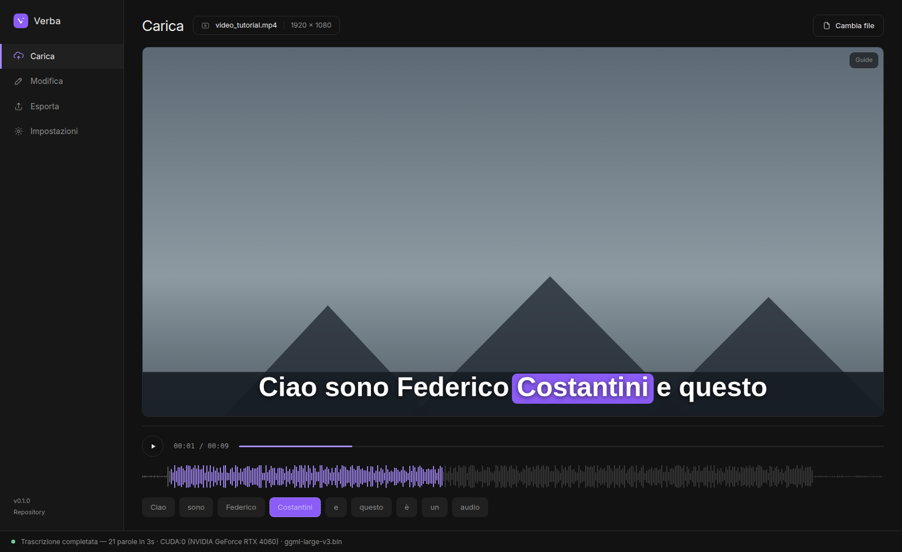
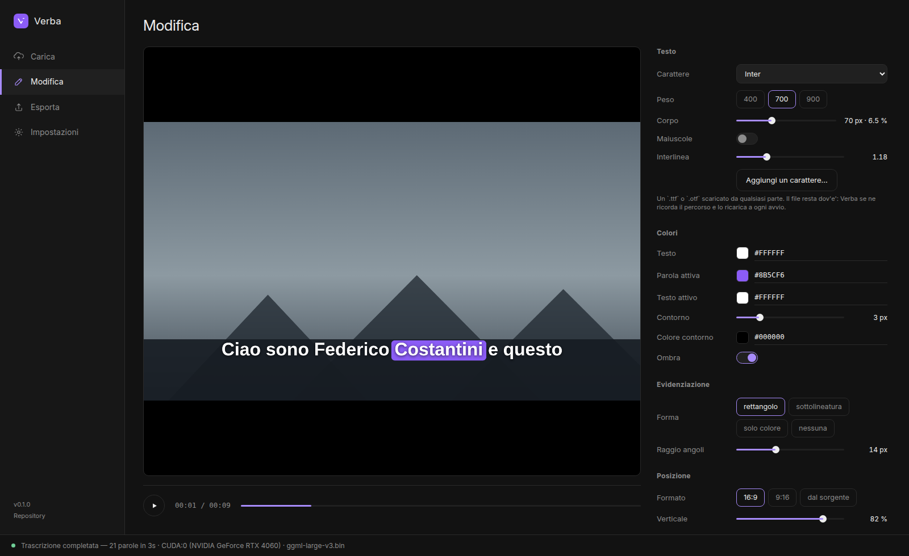
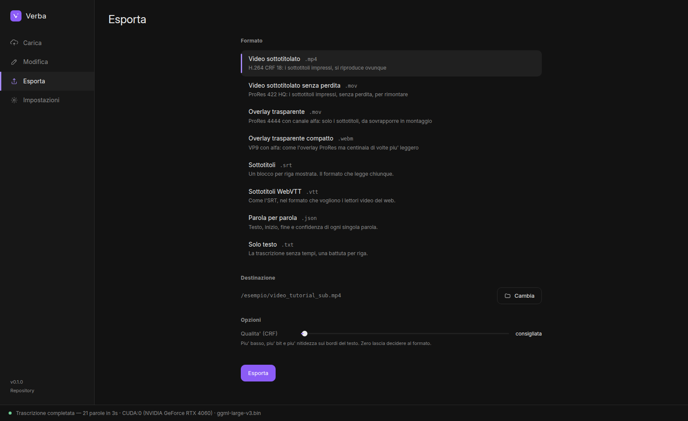
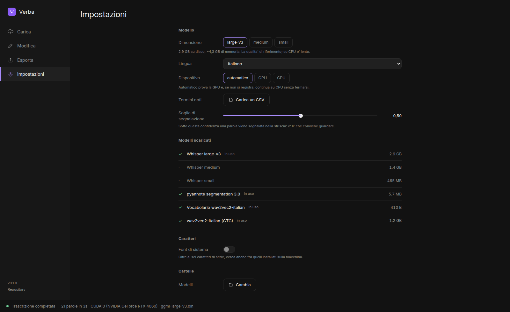

# Verba — sottotitoli automatici in locale

Prende un file audio o video, lo trascrive con i tempi **parola per parola**, e
ne esporta i sottotitoli: come file di testo, come video con i sottotitoli
impressi, o come overlay su sfondo trasparente da montare altrove.

**Gira interamente sulla tua macchina.** Nessun file lasciato su un server,
nessun abbonamento, nessun limite di minuti. E' il motivo per cui esiste.



| Fase | Modello | Runtime |
|---|---|---|
| Pre-elaborazione | — | Symphonia + rubato, tutto in RAM |
| Segmentazione | `pyannote/segmentation-3.0` | ONNX Runtime |
| Trascrizione | `whisper` large-v3 / medium / small | whisper.cpp (GGML) |
| Allineamento | `wav2vec2` italiano (CTC) | ONNX Runtime |
| Impaginazione | — | cosmic-text, da una a tre righe |
| Disegno | — | RGBA con alfa: testo + evidenziazione della parola in corso |
| Codifica | — | libavcodec/libavformat (C++) |
| Uscita | — | `.mp4` `.mov` `.webm` `.srt` `.vtt` `.json` `.txt` |

## Limiti noti, subito

* **Senza GPU funziona lo stesso**, ma large-v3 su CPU e' lento: conta minuti,
  non secondi, per ogni minuto di audio. Con `--modello small` si scende di
  quattro-cinque volte, perdendo qualche nome proprio.
* **Il primo avvio scarica quasi 3 GB** di modelli. Non stanno dentro
  l'eseguibile e non ci possono stare.
* **L'allineatore va esportato a mano** una volta sola, con uno script Python:
  di quel modello non esiste una versione ONNX pubblica di cui fidarsi.
* L'italiano e' la lingua su cui e' stato messo a punto; le altre funzionano ma
  l'allineatore predefinito e' italiano.
* La finestra dell'applicazione e' **1600x980 fissa**, per scelta.

La trascrizione **non passa da alcun file intermedio**: resta in RAM e alimenta
direttamente l'impaginazione e il disegno dei fotogrammi.

I tre modelli non sono mai residenti insieme: ogni fase carica il proprio
modello e lo rilascia prima della successiva. In particolare **Whisper viene
scaricato esplicitamente dalla GPU prima che l'allineatore venga caricato**
(`Transcriber::release()`), e l'occupazione di VRAM viene tracciata nel log
prima e dopo lo scarico.

## Architettura

```
crates/
  verba-core/            libreria: tutta la logica, nessuna dipendenza da UI
    src/
      media.rs           cosa contiene il file, e il fotogramma a un dato istante
      audio.rs           pre-elaborazione: multi-formato -> mono -> 16 kHz -> normalizzazione (0 file temporanei)
      segmentation.rs    pyannote ONNX: finestre da 10 s, powerset/multi-label, isteresi
      transcribe.rs      Whisper large-v3 via whisper.cpp; release() libera la VRAM
      align.rs           wav2vec2 ONNX + Viterbi CTC: intervallo temporale di ogni parola;
                         ripulisci() normalizza la sequenza (buchi, ordine, durate)
      layout.rs          impaginazione: blocchi, righe equilibrate, finestre di accensione
      render.rs          disegno RGBA: maschere, contorno, rettangolo smussato
      encoder.rs         ponte FFI verso l'encoder C++
      video.rs           dalla linea temporale ai fotogrammi codificati
      srt.rs             battute blocchi / parola / riga / karaoke, timestamp HH:MM:SS,mmm
      scena.rs           un solo percorso dal tempo al fotogramma: anteprima ed export
      sessione.rs        lo stato di un lavoro aperto: file, parole, aspetto, anteprima
      pipeline.rs        l'ordine delle fasi, uno solo per tutti i chiamanti
      progetto.rs        preset in JSON e i tre di serie
      impostazioni.rs    cosa ricorda la macchina fra un avvio e l'altro
      modelli.rs         catalogo, scaricamento con ripresa, verifica SHA-256
      cartelle.rs        dove vivono modelli e librerie, sistema per sistema
      caratteri.rs       catalogo dei font, pesi, ricadute annunciate
      eventi.rs          avanzamento per fasi, annullamento
      prompt.rs          initial prompt di Whisper da file CSV di termini
      gpu.rs             selezione GPU su VRAM totale, monitoraggio NVML
      onnx.rs            libreria ORT, provider attivo, softmax / log-softmax
    cpp/
      encoder.h/.cpp     quattro formati di uscita su libavcodec + libavformat
      media.h/.cpp       lettura del file di partenza e decodifica dei fotogrammi
    assets/
      Inter-Bold.ttf     Inter statico peso 700, incorporato nel binario
  verba-cli/             binario `verba`: trascrivi, rendi, overlay, modelli, ...
  verba-app/             applicazione Tauri v2: una finestra sopra verba-core
ui/                      frontend React + Vite: quattro sezioni, banco di prova
assets/
  fonts/                 caratteri aggiuntivi offerti nel selettore
docs/
  piano.md               piano di costruzione della 0.1
  spec.md                la specifica da cui nasce il progetto
scripts/
  export_models.py       esporta pyannote e wav2vec2 in ONNX
  scarica_caratteri.py   scarica e istanzia i caratteri di serie da Google Fonts
esempi/
  vocabolario.csv        CSV di esempio per l'initial prompt
```

`verba-core` non sa che esistono ne' la riga di comando ne' Tauri: espone la
pipeline come funzioni piu' un canale di eventi. E' quello che permette a
`verba-cli` e a `verba-app` di percorrere la stessa strada invece di
orchestrare i modelli ognuno per conto suo — se lo facessero, divergerebbero su
qualche dettaglio e il risultato cambierebbe a seconda di come lo hai chiesto.

### `verba-core/src/audio.rs` — pre-elaborazione (modulo separato, come richiesto)

* **Input misto**: percorsi di file, `-` per stdin, o buffer gia' in memoria
  (`AudioInput::Bytes`); piu' sorgenti nella stessa invocazione vengono
  concatenate dopo il ricampionamento individuale.
* **Multi-formato**: tutto cio' che Symphonia decodifica (MP3, WAV, FLAC,
  OGG/Vorbis, AAC/M4A, MP4, MKV, AIFF...). Se un formato non e' supportato,
  fallback opzionale su `ffmpeg` in *pipe mode* (`pipe:0` -> `pipe:1`).
* **Downmix a mono**: media aritmetica dei canali (niente raddoppio di ampiezza).
* **16 kHz**: ricampionamento sinc band-limited (rubato, finestra
  Blackman-Harris, sinc a 256 tap).
* **Normalizzazione**: rimozione dell'offset DC, guadagno verso un target RMS
  (default −20 dBFS) vincolato da un tetto sul picco (−1 dBFS) e da un guadagno
  massimo (+30 dB), clamp finale in [−1, 1].
* **Zero file temporanei**: nessun percorso su disco viene mai scritto, neppure
  nel fallback ffmpeg.

Verificabile senza modelli:

```bash
cargo run --release -- prova.mp3 --solo-audio -v
```

### Audio o video

Verba si comporta in modo diverso a seconda di cosa gli si da', e la differenza
nasce in `media.rs`.

Con un **file audio** (`.mp3`, `.wav`, `.m4a`, `.flac`, `.ogg`, `.opus`) non c'e'
niente da disegnare sotto i sottotitoli: senza proporzioni da rispettare il
formato ricade sul 9:16, che e' dove i sottotitoli generati finiscono piu'
spesso.

Con un **file video** (`.mp4`, `.mov`, `.mkv`, `.webm`, `.avi`) le proporzioni,
la durata e **il frame rate** vengono dal file. Quest'ultimo conta: un overlay a
30 fps sopra un filmato a 23,976 si sfalsa di qualche fotogramma al minuto, e il
difetto si nota solo dopo, a montaggio fatto.

Un file senza traccia audio non e' un caso da gestire alla meglio, e' un errore
con un messaggio suo:

```
Error: muto.mp4: il file non contiene audio. Serve un file con una traccia audio.
```

Le copertine incorporate nei file audio sono tracce video a tutti gli effetti:
se non venissero riconosciute come tali, un MP3 con la copertina dell'album
passerebbe per un filmato di un fotogramma.

**La conversione dei pixel e' scritta a mano** invece di passare da libswscale,
per la stessa ragione per cui l'encoder non la usa nell'altra direzione: e' una
dipendenza di sistema in meno. Sono gestiti i formati che escono davvero da un
decoder video (`yuv420p`, `yuv422p`, `yuv444p`, le varianti J e a 10 e 12 bit,
`nv12`, `nv21`); per qualsiasi altro c'e' un errore che ne dice il nome. Le
matrici sono BT.601, BT.709 e BT.2020, e quando il file **non dichiara** lo
spazio colore si applica la convenzione dei riproduttori: BT.601 fino alla
definizione standard, BT.709 sopra. Sbagliare qui non produce un errore ma
colori spenti, che e' peggio perche' sembra un difetto del disegno.

Verificato a confronto con ffmpeg: su un file con BT.709 dichiarato lo scarto
massimo e' 3 su 255, cioe' l'arrotondamento.

### Dai tempi delle parole al fotogramma

**`layout.rs` — impaginazione.** Le parole allineate diventano *blocchi*, e a
schermo ne compare uno per volta. Un blocco si chiude quando succede una di
queste cose: una pausa piu' lunga di `--pausa-blocco`, un cambio di segmento di
pyannote, il superamento di `--durata-blocco`, la punteggiatura di fine frase,
oppure — ed e' il vincolo grafico — le parole non entrerebbero piu' nel numero
di righe consentito.

**Il valore predefinito e' una riga sola.** Piu' righe insieme rendono la
lettura caotica, e con l'evidenziazione che salta da una parola all'altra lo
sguardo non saprebbe dove stare. Chi le vuole le chiede con `--righe-massime`,
fino a tre.

Con piu' di una riga le parole non vengono ammassate avidamente sulla prima:
si usa il **numero minimo di righe** e, a parita' di righe, la distribuzione
piu' equilibrata. Il costo di una riga e' lo spazio che le avanza *al quadrato*,
ed e' l'elevamento al quadrato a rendere la soluzione equilibrata invece che
avida — senza, si otterrebbe il difetto tipico dei sottotitoli generati: una
riga piena e una con una parola sola.

La capienza non e' stimata a caratteri: ogni riga candidata viene **misurata con
cosmic-text sul font che verra' davvero disegnato**. In Inter 700 le stringhe
`illlli` e `WWWWWW` hanno lo stesso numero di caratteri e larghezze che
differiscono di piu' del doppio; contare i caratteri farebbe uscire il testo dai
bordi. E se il testo e' in maiuscolo lo e' **gia' qui**, perche' e' piu' largo e
la spezzatura deve tenerne conto.

**La colonna di testo.** La sua larghezza e' la piu' stretta fra quella chiesta
con `--larghezza-massima` e quella che `--margine` concede; e' centrata su
`--posizione-orizzontale` e poi spinta dentro i margini. Lo stesso vale in
verticale: `--posizione-verticale` e' il **centro** del blocco, e il margine ha
sempre l'ultima parola — portare il cursore all'estremo appoggia il blocco al
margine invece di farlo uscire dal fotogramma.

**`render.rs` — disegno.** Il fotogramma e' RGBA con **alfa dritta** (non
premoltiplicata) e sfondo completamente trasparente. L'ordine di sovrapposizione
e' rettangolo, contorno, testo: il rettangolo sta **dietro**, e il testo sopra
resta del suo colore. Il disegno e' in due passate:

1. per riga, una volta sola: i glifi diventano una maschera di copertura, da cui
   il contorno si ricava con una trasformata di distanza chamfer a due passate —
   lineare nell'area invece che proporzionale al quadrato del raggio. Dagli
   stessi glifi si ricava anche il rettangolo di ogni parola;
2. a ogni cambio di parola indicata: si ridisegna il rettangolo e si ricompone
   la maschera gia' pronta. La geometria del testo non cambia dentro una riga,
   quindi il costo per fotogramma resta trascurabile.

La pulizia della tela agisce solo sul riquadro effettivamente sporcato dal
disegno precedente.

### Il rettangolo di evidenziazione

Dietro la parola in corso di pronuncia c'e' un rettangolo pieno con gli angoli
arrotondati, di colore configurabile (viola di default). Non e' un cambio di
colore del testo: il testo resta bianco sopra.

**La geometria viene dallo shaping, non da una nuova misura.** Gli estremi
orizzontali della parola sono il minimo e il massimo dei riquadri d'avanzamento
dei glifi che cosmic-text ha gia' posizionato nella riga, riconosciuti
dall'intervallo di byte che la parola occupa nel testo. Rimisurare la parola
isolata darebbe una larghezza diversa — crenatura con i vicini, spazi che
cadono dentro o fuori — e il rettangolo si scosterebbe progressivamente dal
testo lungo la riga.

**L'altezza viene dal corpo, non dai limiti dei glifi.** Se derivasse
dall'inchiostro, "pagina" (con discendente) e "come" (senza) avrebbero
rettangoli di forma diversa e la riga sembrerebbe ballare a ogni parola.
L'altezza e' quindi `--altezza-evidenziazione` volte il corpo, centrata
sull'altezza della fascia di riga. Anche il padding orizzontale e il raggio
degli angoli sono frazioni del corpo, cosi' la forma resta identica a qualunque
risoluzione.

Il rettangolo e' uno sfondo, non testo: puo' sconfinare nel margine laterale
della misura del padding. Con i valori di default sono 13 px dentro un margine
di 86 px.

**L'accensione e' temporale**, con tre correzioni:

* `--anticipo` — il rettangolo arriva un istante prima dell'inizio nominale
  della parola. Il sistema visivo e' piu' lento di quello uditivo: senza
  anticipo il rettangolo sembra sempre in ritardo;
* `--pausa-massima` — tetto alla permanenza nel silenzio che segue la parola.
  Senza tetto, in una pausa di due secondi il rettangolo resterebbe acceso su
  una parola che non si sta piu' pronunciando. Se la parola successiva arriva
  prima del tetto, il rettangolo le salta addosso senza spegnersi;
* `--coda` — permanenza dopo l'ultima parola della riga, comunque non oltre
  `--tenuta`, che e' quando la riga sparisce.

Quando nessuna finestra contiene l'istante corrente non si disegna alcun
rettangolo: la riga resta a schermo da sola. Il rettangolo **si sposta a scatti**
da una parola all'altra, senza interpolazione: la posizione e' quella della
parola indicata e basta.

**`cpp/encoder.cpp` — codifica.** Contenitore MOV, encoder `prores_ks` in
**profilo 4444**, l'unico ProRes che trasporta il canale alfa, in `yuva444p10le`:
4:4:4 senza sottocampionamento della crominanza, cosi' i bordi del testo restano
netti. La conversione RGBA -> YUVA e' fatta a mano con i coefficienti BT.709
(luminanza e crominanza in range video, alfa a range pieno) invece che con
swscale: e' poche righe, e toglie ogni dubbio su come venga trattata l'alfa.

**`video.rs` — linea temporale.** Il tempo campionato e' il **centro** del
fotogramma. I fotogrammi consecutivi con lo stesso stato (stessa riga, stessa
parola indicata) vengono raggruppati: la conversione colore avviene una volta sola
e il fotogramma gia' convertito viene ricodificato. Su un audio di 9,6 s a 30 fps
questo significa 26 disegni invece di 290.

### I caratteri

Di serie ce ne sono sei, tutti da Google Fonts con licenza OFL, in
`assets/fonts` con le licenze accanto:

| Famiglia | Pesi | Perche' c'e' |
|---|---|---|
| Inter | 400 700 900 | neutro, e' il predefinito |
| Montserrat | 400 700 900 | geometrico, molto usato sui social |
| Poppins | 400 700 900 | geometrico tondo |
| Oswald | 400 700 | condensato: sta dentro il 9:16 anche con righe lunghe |
| Anton | 400 | display pesante |
| Bebas Neue | 400 | tutto maiuscolo, il classico dei sottotitoli |

**Uno solo e' incorporato nel binario**, Inter 700: e' la ricaduta che non puo'
mancare, cosi' un'installazione senza `assets/fonts` produce comunque un
risultato invece di un errore.

Chi ne vuole un altro non deve aspettare una nuova versione: scarica il `.ttf` e
lo passa con `--font FILE`, oppure lo mette in una cartella e la aggiunge con
`--cartella-caratteri`. Con `--caratteri-di-sistema` entrano nell'elenco anche
quelli installati sulla macchina.

Se la famiglia chiesta non c'e' si ricade su Inter, e se il peso non c'e' si usa
**il piu' vicino** — a parita' di distanza il piu' pesante, perche' un
sottotitolo sta meglio in grassetto. In entrambi i casi la sostituzione viene
detta, non lasciata scoprire guardando il risultato:

```
WARN Il peso 900 non e' disponibile per Anton. E' stato usato il 400.
WARN Il carattere «Comic Sans» non e' disponibile. Ne e' stato usato un altro: Inter.
```

I file di serie si rigenerano con `scripts/scarica_caratteri.py`, che scarica da
Google Fonts e istanzia nei pesi che servono le famiglie pubblicate solo in
forma variabile — cosmic-text sceglie il carattere per peso dichiarato, e da un
file variabile ne leggerebbe uno solo.

### I preset

Un preset e' l'aspetto dei sottotitoli in un file JSON: testo, colori,
evidenziazione, posizione, tempi. **Non contiene le impostazioni del modello ne'
riferimenti a file** — le prime perche' cambiarle vorrebbe dire ritrascrivere, i
secondi perche' un preset deve poter passare da una macchina all'altra. Per la
stessa ragione contiene il *formato* e non la risoluzione: un preset verticale
funziona su un 1080x1920 come su un 720x1280.

```bash
verba prova.mp3 --carattere Poppins --peso 900 --righe-massime 2 \
      --evidenziazione sottolineatura --colore-evidenziazione '#E0B25C' \
      --salva-preset mio.json -o prova.mov

verba altro.mp3 --preset mio.json -o altro.mov
```

Le opzioni scritte a mano scavalcano il preset, non il contrario:

```bash
verba altro.mp3 --preset mio.json --carattere Oswald -o altro.mov
```

Perche' questo funzioni la riga di comando distingue un'opzione **scritta** da
una lasciata al valore predefinito: senza quella distinzione il preset verrebbe
sempre sovrascritto dai valori di serie di clap, che sono indistinguibili da una
scelta esplicita.

Tre preset ci sono gia': `verticale` (9:16, una riga, rettangolo viola),
`orizzontale` (16:9, due righe, colonna piu' stretta) e `sobrio` (nessuna
evidenziazione, solo testo bianco con contorno).

### I formati di uscita

| Cosa produce | `--uscita` | File | Codec |
|---|---|---|---|
| Video sottotitolato | `video` | `.mp4` | H.264 CRF 18, `yuv420p` |
| Video sottotitolato senza perdita | `video-prores` | `.mov` | ProRes 422 HQ |
| Overlay trasparente | `overlay` | `.mov` | ProRes 4444, `yuva444p10le` |
| Overlay trasparente compatto | `overlay-webm` | `.webm` | VP9 con alfa |

I due **overlay** contengono solo i sottotitoli su sfondo trasparente e si
sovrappongono al filmato in montaggio; i due **video** hanno i sottotitoli
impressi e richiedono un file video di partenza — da un file audio si puo'
produrre solo un overlay, e chiederlo lo dice invece di fallire a meta'.

I video sottotitolati **portano l'audio del file di partenza**, copiato senza
ricodifica. I due overlay no, di proposito: in montaggio ci si ritroverebbe la
stessa traccia due volte.

Il nome proposto e' quello del sorgente con un suffisso — `_sub` per i video,
`_overlay` per gli overlay — nella stessa cartella.

**Sulla dimensione:** su un campione di dieci secondi a 720p il ProRes 4444
occupa 32 MB e il WebM 316 KB. Il rapporto e' di due ordini di grandezza, e
regge anche su file lunghi; il prezzo e' una codifica piu' lenta.

**Una nota sul WebM con alfa.** Il canale c'e', ma il decodificatore VP9 nativo
di ffmpeg lo ignora: `ffprobe` dichiara `yuv420p` e un `ffmpeg -i ... -pix_fmt
rgba` restituisce un fotogramma opaco. Per vederlo bisogna chiedere
esplicitamente il decodificatore di libvpx:

```bash
ffmpeg -vcodec libvpx-vp9 -i overlay.webm -pix_fmt rgba ...
```

Il tag `alpha_mode=1` nel contenitore dice che l'alfa c'e'. I browser e i
programmi di montaggio che supportano VP9 con alfa la leggono senza dover
chiedere nulla.

## Installazione

**Prima di tutto: il primo avvio scarica quasi 3 GB di modelli.** Non stanno
dentro l'eseguibile e non ci possono stare — Whisper large-v3 da solo ne pesa
2,9. Con `--modello small` scendono a 465 MB, perdendo qualche nome proprio.

I pacchetti sono allegati alle
[release](https://github.com/zerflyne/verba/releases): `.deb` per Debian e
Ubuntu, `.AppImage` per le altre distribuzioni, un installer `.exe` per Windows.

```bash
sudo dpkg -i verba_0.1.0_amd64.deb          # Debian, Ubuntu
chmod +x Verba_0.1.0_amd64.AppImage         # altre distribuzioni
```

**Su Windows l'installer non e' firmato**, e SmartScreen mostra *«Windows ha
protetto il PC»*. Un certificato di firma costa qualche centinaio di euro
l'anno e non ha senso per un progetto a questo punto. Per procedere: clic su
**Ulteriori informazioni**, poi su **Esegui comunque**. Se l'avviso non compare
del tutto e il file sparisce, e' Defender che l'ha messo in quarantena: va
ripristinato dalla cronologia delle protezioni.

Chi preferisce compilare trova tutto nella sezione seguente.

## Prerequisiti di build

```bash
sudo apt install build-essential cmake clang libclang-dev pkg-config \
                 libavcodec-dev libavformat-dev libavutil-dev
```

`cmake` compila whisper.cpp; `clang` serve a bindgen; gli header `libav*`
servono all'encoder video in `cpp/`. Se gli header non sono installati a livello
di sistema si possono indicare a mano:

```bash
FFMPEG_INCLUDE_DIR=/percorso/include FFMPEG_LIB_DIR=/percorso/lib cargo build --release
``` Se bindgen non trova
`stdbool.h` (accade con clang senza i propri header di sistema):

```bash
export BINDGEN_EXTRA_CLANG_ARGS="-I$(dirname $(find /usr/lib/gcc -name stdbool.h | head -1))"
```

### ONNX Runtime

Il crate `ort` e' configurato in `load-dynamic`: la libreria viene caricata a
runtime, quindi si sceglie liberamente la build CPU o GPU.

```bash
# build GPU ufficiale (CUDA 12 + cuDNN 9)
wget https://github.com/microsoft/onnxruntime/releases/download/v1.22.0/onnxruntime-linux-x64-gpu-1.22.0.tgz
tar xf onnxruntime-linux-x64-gpu-1.22.0.tgz
mkdir -p ~/.local/share/verba/lib
cp onnxruntime-linux-x64-gpu-1.22.0/lib/libonnxruntime*.so* ~/.local/share/verba/lib/
```

Verba la cerca da sola, in quest'ordine: `ORT_DYLIB_PATH`, la cartella
dell'eseguibile (e `lib/`, `../lib/`), `~/.local/share/verba/lib`, le cartelle
di sistema. La variabile d'ambiente serve solo per scavalcare tutto il resto:
un pacchetto `.deb` o un `.AppImage` si porta dietro la libreria e non ne ha
bisogno.

La versione e' vincolata: `ort 2.0.0-rc.10` legge `GetVersionString` all'avvio
e accetta **solo la 1.22.x**.

In alternativa, `--features ort-download` fa scaricare i binari a `ort`
(richiede `libssl-dev`).

#### Librerie CUDA a runtime

`libonnxruntime_providers_cuda.so` non porta con se' le librerie CUDA: le cerca
via `LD_LIBRARY_PATH`. Oltre a `cudart`, `cublas` e `cudnn` gli servono anche
`curand`, `cufft` e `nvrtc`. Se una sola manca, il provider CUDA non si
registra: Verba **ricade su CPU senza fermarsi**, e lo scrive nel log —

```
WARN CUDA non utilizzabile per ONNX Runtime: si continua su CPU
     (piu' lento, stesso risultato) errore=... libcublasLt.so.12: cannot open ...
```

— cosi' non si finisce a chiedersi perche' e' lento. Per verificare prima di
lanciare (nessuna riga in uscita = tutto a posto):

```bash
ldd ~/.local/share/verba/lib/libonnxruntime_providers_cuda.so | grep "not found"
```

Se sul sistema non c'e' un CUDA toolkit, le librerie di un ambiente Python con
PyTorch vanno benissimo (CUDA 12 + cuDNN 9 sono le versioni richieste):

```bash
NV=/percorso/venv/lib/python3.12/site-packages/nvidia
export LD_LIBRARY_PATH="$(find "$NV" -maxdepth 2 -type d -name lib -printf '%p:' | sed 's/:$//')${LD_LIBRARY_PATH:+:$LD_LIBRARY_PATH}"
```

### Build

```bash
cargo build --release                     # solo CPU
cargo build --release --features vulkan   # Whisper su GPU via Vulkan
cargo build --release --features cuda     # Whisper su GPU via CUDA
```

Le feature riguardano **solo Whisper**: ONNX Runtime prende la GPU senza feature
aggiuntive, gli basta che `ORT_DYLIB_PATH` punti a una build GPU.

|  | Richiede | Note |
|---|---|---|
| `cuda` | CUDA toolkit con `nvcc` (2-3 GB) | La piu' veloce. whisper.cpp compila i kernel in fase di build. |
| `vulkan` | `libvulkan-dev` e `glslc` (~50 MB) | Piu' lenta di CUDA, molto piu' veloce della CPU. Funziona anche sulle schede abbandonate dai toolkit recenti (Tesla P40, compute 6.1). |

```bash
sudo apt install libvulkan-dev glslc     # per --features vulkan
```

whisper.cpp con Vulkan enumera i dispositivi per conto suo e non segue
`--gpu`: se sceglie la scheda sbagliata, si forza con
`GGML_VK_VISIBLE_DEVICES=0` davanti al comando.

### L'applicazione

`cargo build --release` compila **solo il motore e la riga di comando**.
L'applicazione con la finestra non e' fra i membri predefiniti del workspace:
tirarsi dietro GTK, WebKit e D-Bus per compilare una riga di comando sarebbe un
pedaggio ingiustificato, e su una macchina senza quelle librerie `cargo build`
fallirebbe anche a chi della finestra non sa che farsene.

Su Debian e Ubuntu servono:

```bash
sudo apt install libwebkit2gtk-4.1-dev libgtk-3-dev \
                 libayatana-appindicator3-dev librsvg2-dev \
                 libdbus-1-dev patchelf
```

Poi:

```bash
npm install --prefix ui
cargo install tauri-cli --version "^2"    # una volta sola
cargo tauri dev --config crates/verba-app/tauri.conf.json      # sviluppo
cargo tauri build --config crates/verba-app/tauri.conf.json    # .deb, .AppImage
```

Per compilare il solo binario, senza pacchetti e senza `tauri-cli`:

```bash
npm run build --prefix ui && cargo build -p verba-app --release
```

Il binario di `--release` incorpora `ui/dist` e si avvia da solo. Quello di
debug, invece, carica l'interfaccia da `http://localhost:5173`: va acceso
prima `npm run dev --prefix ui`, altrimenti la finestra si apre su
*Connection refused*.

**L'interfaccia da sola**, senza il motore, si guarda in un browser:

```bash
npm run dev --prefix ui        # http://localhost:5173
```

Fuori da Tauri il ponte verso il motore risponde con dati finti
(`ui/src/banco.ts`): nessun file viene letto o scritto, e la console lo dice a
chiare lettere. Serve a lavorare sull'aspetto senza ricompilare il motore a
ogni modifica del CSS, e a vedere la finestra su una macchina che non ha WebKit.

## Modelli

**Il primo avvio scarica circa 3 GB.** I modelli non stanno dentro
l'eseguibile — Whisper large-v3 da solo ne pesa 2,9 — e vivono nella cartella
dati dell'utente:

| Sistema | Cartella |
|---|---|
| Linux | `$XDG_DATA_HOME/verba/models`, altrimenti `~/.local/share/verba/models` |
| Windows | `%LOCALAPPDATA%\verba\models` |
| macOS | `~/Library/Application Support/verba/models` |

`VERBA_DATA_DIR` scavalca tutto, e `--cartella-modelli` la scavalca per un
singolo comando. Se stai lavorando dentro il repository e i modelli sono in
`./models`, Verba usa quelli senza chiedere.

```bash
verba modelli                         # cosa c'e', cosa manca, quanto occupa
verba modelli --scarica               # scarica quello che manca
verba modelli --scarica --modello small
verba modelli --verifica              # ricalcola le impronte SHA-256
verba modelli --rimuovi medium
```

Di ogni file si verifica l'impronta SHA-256 dichiarata dal repository di
origine, e uno scaricamento interrotto **riprende**: il file in corso si chiama
`nome.parziale` finche' l'impronta non torna, e solo allora prende il nome
definitivo. `Ctrl-C` lo interrompe lasciando il pezzo scaricato dov'e'.

### La dimensione del modello

| Dimensione | Disco | Memoria | Velocita' |
|---|---|---|---|
| `large-v3` (default) | 2,9 GB | ~4,3 GB | la qualita' di riferimento; su CPU e' lento |
| `medium` | 1,4 GB | ~2,2 GB | circa due volte piu' veloce, qualche nome proprio in meno |
| `small` | 465 MB | ~1 GB | quattro-cinque volte piu' veloce; per una bozza o per una macchina modesta |

Si sceglie con `--modello`, su qualsiasi comando.

### L'allineatore va esportato

Tre file su quattro si scaricano da soli. Il quarto — wav2vec2 italiano in
ONNX, quello che da' il tempo esatto di **ogni parola** — non esiste in una
versione pubblica di cui fidarsi, e va prodotto una volta sola sulla propria
macchina:

```bash
pip install "torch>=2.2" onnx transformers huggingface_hub
python scripts/export_models.py --w2v
mv wav2vec2-italian.onnx wav2vec2-italian.vocab.json ~/.local/share/verba/models/
```

Il modello di partenza e' `jonatasgrosman/wav2vec2-large-xlsr-53-italian`; se
ne puo' usare un altro con `--w2v-model`. Lo script salva anche il
`vocab.json`, da cui il programma deduce da solo blank CTC, delimitatore di
parola e maiuscolo/minuscolo — ma quel file, essendo piccolo e pubblico, lo
scarica gia' `verba modelli --scarica`.

Per la segmentazione Verba usa l'esportazione ONNX di
`onnx-community/pyannote-segmentation-3.0`, che **non e' gated**: nessun
account, nessun token, nessuna condizione da accettare al primo avvio. Da'
gli stessi segmenti dell'esportazione fatta in casa da
`pyannote/segmentation-3.0` (verificato sullo stesso audio), che resta
disponibile con `scripts/export_models.py --pyannote --hf-token hf_xxx` per chi
la preferisce.

**Attenzione al language model.** Quel repo contiene una cartella
`language_model/` e il suo `preprocessor_config.json` dichiara
`"processor_class": "Wav2Vec2ProcessorWithLM"`, quindi `AutoProcessor` pretende
`pyctcdecode` e l'esportazione fallisce. Il LM non serve a niente qui: lo script
legge dal processor solo il vocabolario, e l'allineamento CTC lo fa Viterbi in
Rust. La via pulita e' una cartella specchio senza la parte LM, con i pesi
lasciati come symlink:

```bash
S=/percorso/wav2vec2-italian; D=/percorso/wav2vec2-senza-lm
mkdir -p "$D" && ln -sf "$S/pytorch_model.bin" "$D/" \
  && cp "$S/config.json" "$S/vocab.json" "$S/special_tokens_map.json" "$D/" \
  && python3 -c "import json; d=json.load(open('$S/preprocessor_config.json')); d['processor_class']='Wav2Vec2Processor'; json.dump(d,open('$D/preprocessor_config.json','w'),indent=2)"
```

poi `--w2v-model "$D"`.

Risultato atteso in `models/`:

```
ggml-large-v3.bin
pyannote-segmentation-3.0.onnx
wav2vec2-italian.onnx
wav2vec2-italian.vocab.json
```

## Initial prompt da CSV

Whisper accetta un testo di contesto che precede idealmente l'audio: e' la via
ufficiale per orientarlo su nomi propri, sigle e termini tecnici. Le parole con
cui inizializzare il modello si mettono in un CSV:

```csv
# esempi/vocabolario.csv
termine,categoria,note
Anthropic,azienda,
Claude Opus,modello,
wav2vec2,tecnico,allineatore CTC
"Milano, Italia",luogo,esempio con virgola nel termine
```

```bash
verba prova.mp3 --prompt-csv esempi/vocabolario.csv
```

Il parser e' tollerante e non richiede configurazione:

* **delimitatore** dedotto fra `,` `;` `\t` `|` (forzabile con `--prompt-delimiter`);
* **intestazione** riconosciuta e scartata da sola; un elenco di nomi propri
  non viene mai scambiato per un header;
* **colonna** selezionabile per nome (`--prompt-column termine`) o per indice
  (`--prompt-column 1`); default: la prima. Una colonna inesistente e' un
  errore esplicito che elenca quelle disponibili;
* **virgolette** RFC 4180, quindi un termine puo' contenere virgole;
* righe vuote e commenti `#` ignorati, duplicati rimossi ignorando
  maiuscole/minuscole ma conservando la prima grafia — che e' quella suggerita
  al modello.

Il CSV si combina con il prompt libero, che lo precede:

```bash
verba prova.mp3 \
  --prompt-csv esempi/vocabolario.csv \
  --prompt "Intervista tecnica in italiano." \
  --prompt-preamble "Termini ricorrenti:"
# -> "Intervista tecnica in italiano. Termini ricorrenti: Anthropic, Claude Opus, ..."
```

**Limite di lunghezza.** whisper.cpp accetta al massimo `n_text_ctx / 2` token
di contesto (224 per large-v3) e un prompt piu' lungo verrebbe troncato in modo
cieco, magari a meta' di un nome. Il default di 700 caratteri
(`--prompt-max-chars`) resta sotto quel limite anche nel caso peggiore; i
termini in eccesso vengono scartati **a termine intero** e il log dice quanti.
Con un vocabolario molto grande conviene quindi ordinare il CSV per importanza:
i primi termini sono quelli che arrivano al modello.

Per vedere il prompt senza trascrivere nulla:

```bash
verba prova.mp3 --prompt-csv esempi/vocabolario.csv --solo-prompt
```

Il prompt viene costruito e validato **prima** della decodifica audio e del
caricamento dei modelli: un CSV malformato fallisce subito.

## Uso

Tre comandi, uno per ciascuna cosa che si puo' volere.

| Comando | Cosa produce |
|---|---|
| `verba trascrivi` | sottotitoli come file di testo: `.srt`, `.vtt`, `.json`, `.txt` |
| `verba rendi` | il filmato di partenza con i sottotitoli **impressi** |
| `verba overlay` | i soli sottotitoli su **sfondo trasparente**, da montare sopra |

piu' tre che si limitano a dire cosa c'e': `verba caratteri`, `verba preset`,
`verba formati`.

Il **formato non si dichiara**: lo dice l'estensione di `--out`.

| Comando | Estensione | Cosa esce |
|---|---|---|
| `trascrivi` | `.srt` | un blocco per riga mostrata |
| | `.vtt` | lo stesso, per il web |
| | `.json` | parola per parola: testo, inizio, fine, confidenza |
| | `.txt` | solo il testo |
| `rendi` | `.mp4` | H.264 CRF 18, `yuv420p` — si riproduce ovunque |
| | `.mov` | ProRes 422 HQ — senza perdita, per chi rimonta |
| `overlay` | `.mov` | ProRes 4444, `yuva444p10le` |
| | `.webm` | VP9 con alfa — centinaia di volte piu' leggero, piu' lento |

### Prima di lanciarlo

1. **`libonnxruntime.so` raggiungibile.** Verba la cerca accanto all'eseguibile,
   in `~/.local/share/verba/lib`, nelle cartelle di sistema, e infine dove dice
   `ORT_DYLIB_PATH`. Il modo piu' semplice e' copiarla una volta:
   ```bash
   mkdir -p ~/.local/share/verba/lib
   cp /percorso/onnxruntime/lib/libonnxruntime*.so* ~/.local/share/verba/lib/
   ```
   Se manca, il programma lo dice subito e spiega dove metterla.
2. **I modelli.** `verba modelli` dice cosa manca, `verba modelli --scarica`
   lo scarica. Se manca qualcosa, i comandi si fermano subito dicendo cosa e
   come averlo — non a decodifica finita.
3. **La build fatta**, `target/release/verba`.

### Esecuzione

Le tre forme minime:

```bash
verba trascrivi discorso.mp3 --out sottotitoli.srt --lingua it --termini glossario.csv
verba rendi     filmato.mp4  --out filmato_sub.mp4 --preset orizzontale.json
verba overlay   filmato.mp4  --out overlay.mov     --preset verticale.json
```

Senza `--out` il nome viene proposto accanto al sorgente: `discorso.srt`,
`filmato_sub.mp4`, `filmato_overlay.mov`.

Piu' formati di testo in una passata sola — la trascrizione avviene una volta:

```bash
verba trascrivi intervista.m4a --out sub.srt --out sub.vtt --out parole.json --out testo.txt
```

Un video con i sottotitoli impressi e, insieme, l'SRT da caricare altrove:

```bash
verba rendi conferenza.mkv --out conferenza_sub.mp4 --srt conferenza.srt
```

Overlay verticale per i social, da un file audio (non c'e' un filmato, quindi
le proporzioni le scegli tu):

```bash
verba overlay podcast.mp3 --out podcast_overlay.mov --formato 9:16 --risoluzione 1080x1920
```

Stile: rettangolo arancione piu' schiacciato e piu' squadrato, contorno spesso,
sottotitoli a meta' altezza.

```bash
verba overlay intervista.m4a \
    --colore-evidenziazione '#F97316' --altezza-evidenziazione 0.95 \
    --raggio-evidenziazione 0.08 --colore-bordo '#101010' --bordo 8 \
    --posizione centro
```

Accensione: evidenziazione piu' in anticipo, che si spegne prima nei silenzi e
non resta in coda alla riga.

```bash
verba overlay intervista.m4a --anticipo 0.12 --pausa-massima 0.15 --coda 0
```

Nessuna evidenziazione, righe piu' lunghe:

```bash
verba overlay intervista.m4a --senza-evidenziazione --durata-blocco 8
```

Piu' sorgenti concatenate, e ingresso da stdin:

```bash
verba trascrivi parte1.wav parte2.mp3 --out tutto.srt
cat registrazione.opus | verba overlay - --out out.mov
```

Solo pre-elaborazione audio, con statistiche: non carica alcun modello, ed e'
il modo piu' rapido per verificare che la build regga.

```bash
verba trascrivi prova.mp3 --solo-audio -v
```

### Dentro uno script

`--json`, su qualsiasi comando, scrive l'avanzamento su **stderr** come un
oggetto JSON per riga. Su **stdout** non finisce niente che non sia stato
chiesto, quindi le pipe e i redirect funzionano come ci si aspetta.

```bash
verba rendi filmato.mp4 --out out.mp4 --json 2> avanzamento.jsonl
```

```json
{"evento":"iniziata","fase":"trascrizione"}
{"evento":"avanzamento","fase":"codifica","frazione":0.5}
{"evento":"conclusa","fase":"codifica","secondi":3.22}
{"evento":"avviso","messaggio":"..."}
{"evento":"annullata"}
```

`Ctrl-C` non uccide il processo: chiede alla pipeline di fermarsi al primo punto
utile, cosi' il file video parziale viene **cancellato** invece di restare li' a
sembrare un export riuscito.

### Averlo nel PATH

```bash
ln -s "$PWD/target/release/verba" ~/.local/bin/verba
```

Cosi' pero' si perde il `models/` relativo: lanciandolo da fuori dalla cartella
del progetto vanno passati i quattro percorsi assoluti dei modelli. In
alternativa si tiene un alias che entra prima nella cartella.

### Cosa aspettarsi

* **Formati in ingresso**: qualsiasi cosa Symphonia decodifichi, piu' i
  container video aperti con libavformat, quindi anche un MP4 o un MKV
  direttamente, senza estrarre prima l'audio.
* **Picco di VRAM**: circa 4,3 GB con Whisper large-v3 caricato. Le fasi non
  convivono mai — Whisper viene scaricato prima che l'allineatore parta —
  quindi quello e' il massimo, non la somma.
* **Senza GPU funziona lo stesso**, solo piu' lentamente: se il provider CUDA
  non si registra, Verba ricade su CPU **senza errori bloccanti** e lo scrive
  nel log. Non serve fare niente.
* **Dimensione del file**: ProRes 4444 e' un codec da montaggio, non da
  distribuzione. A 1080x1920 e 30 fps sono circa 3,4 MB/s; lo stesso overlay in
  `.webm` sta in un paio di centinaia di kilobyte. `--qualita` piu' alta fa
  calare il file, a scapito della nitidezza dei bordi.
* **Tempo di codifica**: cresce con la risoluzione e con il frame rate, non con
  il numero di parole.

### Il file di overlay

Il `.mov` e il `.webm` contengono una sola traccia video: nessun audio, nessun
video di fondo, solo i sottotitoli su trasparenza. In un montaggio vanno messi
su una traccia superiore a quella del video; il canale alfa viene riconosciuto
da Resolve, Premiere, Final Cut e da `ffmpeg -filter_complex overlay`.

L'alfa e' **dritta** (non premoltiplicata). Se il programma di montaggio chiede
come interpretarla, va scelta *straight* / *non premultiplied*.

Per vedere subito il risultato:

```bash
ffmpeg -i video.mp4 -i overlay.mov -filter_complex overlay -c:a copy anteprima.mp4
```

### Opzioni

Le opzioni di **Carattere**, **Posizione**, **Tempi**, **Stile** e **Preset**
valgono per tutti e tre i comandi — anche per `trascrivi`, perche' un SRT «a
blocchi» ricalca esattamente le righe che comparirebbero nel video, e quelle
dipendono dal carattere e dalla larghezza della colonna.

`verba <comando> --help` le elenca tutte, raggruppate.

**Uscita**

| Opzione | Comandi | Default | Descrizione |
|---|---|---|---|
| `-o`, `--out FILE` | tutti | accanto al sorgente | l'estensione sceglie il formato; in `trascrivi` e' ripetibile |
| `--srt` / `--vtt` / `--txt` / `--mappa FILE` | `rendi`, `overlay` | — | file di testo in piu' |
| `--srt-struttura blocchi\|parola\|riga\|karaoke` | tutti | `blocchi` | struttura dei sottotitoli di testo |
| `--srt-caratteri-max` | tutti | `84` | caratteri per battuta in `riga` e `karaoke` |

**Codifica** (`rendi`, `overlay`)

| Opzione | Default | Descrizione |
|---|---|---|
| `--fps` | dal sorgente, o `30` | intero, decimale o frazione (`30000/1001`) |
| `--durata` | durata audio | durata del video in secondi |
| `--qualita` | consigliata per il formato | quantizzatore ProRes o CRF: piu' basso, piu' qualita' |

**Carattere**

| Opzione | Default | Descrizione |
|---|---|---|
| `--carattere` | `Inter` | famiglia; `verba caratteri` elenca quelle disponibili |
| `--peso` | `700` | peso da 100 a 900; se manca si usa il piu' vicino e lo si dice |
| `--font FILE` | — | un `.ttf` o `.otf` preciso, senza doverlo installare |
| `--cartella-caratteri` | — | cartella con altri caratteri; ripetibile |
| `--caratteri-di-sistema` | off | cerca anche fra i caratteri installati |
| `--dimensione-font` | 6,5 % del lato minore | corpo in pixel, riferiti all'altezza del fotogramma |
| `--maiuscole` | off | disegna il testo in maiuscolo |
| `--interlinea` | `1.18` | multiplo del corpo; e' la fascia su cui il rettangolo e' centrato |

**Posizione**

| Opzione | Default | Descrizione |
|---|---|---|
| `--formato 9:16\|16:9\|dal-sorgente` | `dal-sorgente` | proporzioni del fotogramma |
| `--risoluzione LxA` | dal formato | risoluzione esplicita, dimensioni pari |
| `--margine` | `0.05` | distanza minima dai bordi: limite invalicabile |
| `--larghezza-massima` | `0.80` | larghezza della colonna di testo, frazione della larghezza |
| `--posizione-verticale` | `0.82` | centro verticale del blocco, 0 in alto e 1 in basso |
| `--posizione-orizzontale` | `0.50` | centro orizzontale della colonna |
| `--posizione alto\|centro\|basso` | — | forma per nome di `--posizione-verticale` (18 %, 50 %, 82 %) |
| `--righe-massime 1\|2\|3` | `1` | righe che compaiono insieme |
| `--allineamento sinistra\|centro\|destra` | `centro` | allineamento dentro la colonna |

Con `rendi` la risoluzione **non e' negoziabile**: e' quella del filmato. Se il
preset ne chiede un'altra viene ignorata, e lo si dice.

**Tempi**

| Opzione | Default | Descrizione |
|---|---|---|
| `--durata-blocco` | `5.0` | durata massima di un blocco, in secondi |
| `--pausa-blocco` | `0.7` | pausa che chiude il blocco, in secondi |
| `--tenuta` | `0.30` | permanenza del blocco dopo l'ultima parola, in secondi |
| `--anticipo` | `0.06` | quanto l'evidenziazione precede la parola, in secondi |
| `--pausa-massima` | `0.60` | tetto alla permanenza nel silenzio, in secondi |
| `--coda` | `0.40` | permanenza dopo l'ultima parola del blocco, in secondi |
| `--durata-minima-parola` | `0.08` | durata minima attribuita a una parola, in secondi |

**Stile**

| Opzione | Default | Descrizione |
|---|---|---|
| `--colore` | `#FFFFFF` | testo, `#RRGGBB` o `#RRGGBBAA` |
| `--colore-attivo` | `#FFFFFF` | colore del testo della parola in corso |
| `--evidenziazione rettangolo\|sottolineatura\|solo-colore\|nessuna` | `rettangolo` | forma con cui si segnala la parola in corso |
| `--senza-evidenziazione` | off | equivale a `--evidenziazione nessuna` |
| `--colore-evidenziazione` | `#7C3AED` | colore della forma |
| `--padding-evidenziazione` | `0.18` | margine oltre la parola, in frazione del corpo |
| `--altezza-evidenziazione` | `1.12` | altezza del rettangolo, in frazione del corpo |
| `--raggio-evidenziazione` | `0.20` | raggio degli angoli, in frazione del corpo |
| `--spessore-sottolineatura` | `0.10` | spessore della barra, in frazione del corpo |
| `--colore-bordo` | `#000000` | contorno del testo |
| `--bordo` | `0.0` | spessore del contorno in pixel |
| `--senza-ombra` | off | spegne l'ombra, che di serie e' accesa |
| `--colore-ombra` | `#000000A0` | colore dell'ombra |
| `--ombra-spostamento` | `0.05` | spostamento verso il basso, in frazione del corpo |
| `--ombra-sfocatura` | `0.08` | sfocatura, in frazione del corpo |

**Preset**

| Opzione | Default | Descrizione |
|---|---|---|
| `--preset FILE` | — | carica l'aspetto da un preset |
| `--preset-di-serie verticale\|orizzontale\|sobrio` | — | parte da uno dei tre di serie |
| `--salva-preset FILE` | — | salva l'aspetto risultante |

**Trascrizione, modelli e dispositivo**

| Opzione | Default | Descrizione |
|---|---|---|
| `--lingua` | `it` | lingua Whisper (`auto` per rilevamento) |
| `--beam` | `5` | ampiezza del beam search |
| `--prompt` | — | prompt iniziale libero (stile, punteggiatura) |
| `--termini FILE` | — | CSV con i termini noti |
| `--termini-colonna` | prima | colonna del CSV, per nome o indice |
| `--termini-delimitatore` | auto | forza il delimitatore del CSV |
| `--termini-preambolo` | — | testo davanti all'elenco dei termini |
| `--prompt-max-caratteri` | `700` | limite del prompt (~224 token Whisper) |
| `--solo-prompt` | off | stampa l'initial prompt ed esce |
| `--modello small\|medium\|large-v3` | `large-v3` | dimensione del modello di trascrizione |
| `--cartella-modelli` | cartella dati, o `./models` | dove stanno i modelli |
| `--scarica-modelli` | off | scarica quello che manca invece di fermarsi |
| `--modello-whisper` | dal catalogo | un file GGML preciso |
| `--modello-segmentazione` | dal catalogo | pyannote in ONNX |
| `--modello-allineamento` | dal catalogo | wav2vec2 CTC in ONNX |
| `--vocabolario-allineamento` | dal catalogo | vocabolario del tokenizer |
| `--vram-minima-mib` | `8000` | VRAM **totale** minima per usare la GPU |
| `--gpu INDICE` | auto | forza una GPU specifica |
| `--cpu` | off | forza la CPU |
| `--thread` | tutti i core | thread per ONNX, whisper.cpp e l'encoder |
| `--normalizza niente\|picco\|rms` | `rms` | strategia di normalizzazione |
| `--dbfs-obiettivo` | `-20` | target RMS |
| `--senza-ffmpeg` | off | disattiva il fallback su ffmpeg in decodifica |
| `--soglia-attacco` / `--soglia-rilascio` | `0.50` / `0.60` | soglie di isteresi di pyannote |
| `--senza-segmentazione` | off | finestre uniformi al posto di pyannote |
| `--solo-audio` | off | solo pre-elaborazione, con statistiche |

**Globali** (validi su qualsiasi comando, in qualsiasi posizione)

| Opzione | Default | Descrizione |
|---|---|---|
| `--json` | off | avanzamento in JSON su stderr, un oggetto per riga |
| `--progresso testo\|json\|muto` | `testo` | forma dell'avanzamento su stderr |
| `-v`, `--verbose` | off | log di debug |

I nomi inglesi di prima (`--language`, `--prompt-csv`, `--threads`,
`--srt-mode`, `--whisper-model`, `--gpu-index`, `--min-vram-mib`, …) restano
accettati come alias, cosi' gli script scritti prima continuano a funzionare.
### Selezione della GPU

La regola e' **VRAM totale >= soglia**, indipendentemente da quanta memoria sia
libera al momento: le fasi si susseguono una alla volta, quindi la memoria
occupata da altri processi al momento della scelta non e' un criterio utile.
Fra le GPU idonee vince quella con piu' VRAM totale.

La soglia di default e' 8000 MiB e non 8192: una scheda "da 8 GB" espone spesso
8188 MiB, e una soglia in GiB stretti la escluderebbe per 4 MiB.

## Le altre schermate

| | |
|---|---|
|  |  |
| **Modifica** — l'anteprima a sinistra, i controlli a destra. Nessuna modifica qui rilancia il modello: tutto si applica entro un fotogramma. | **Esporta** — i formati che hanno senso per questo file. In modalita' audio quelli video non compaiono affatto. |



Le schermate sono generate da `scripts/schermate.sh`: l'interfaccia viene
aperta in Chrome headless con il banco di prova, senza toccare niente a mano.

## Distribuzione

Il workflow `.github/workflows/rilascio.yml` costruisce i tre pacchetti su ogni
tag `v*` e li allega a una release in bozza.

Due cose che vengono impacchettate e due che non lo sono:

* **ONNX Runtime viaggia con l'applicazione.** Il workflow la scarica dalla
  release ufficiale di Microsoft (1.22.x, l'unica che `ort 2.0.0-rc.10`
  accetta) e la mette in `crates/verba-app/lib`, che `tauri.conf.json` dichiara
  come risorsa. Chi installa non deve sapere che esiste.
* **I modelli no.** Sono quasi tre gigabyte: li scarica l'applicazione al primo
  avvio, con la barra di avanzamento e la ripresa se il collegamento cade.
* **L'allineatore neanche**, e va esportato a mano: vedi sopra.
* La riga di comando viene compilata nello stesso giro e allegata come
  eseguibile a se'.

## Come nascono i tempi delle parole

Whisper fornisce il testo, non tempi affidabili a livello di parola. Questi
arrivano da un **allineamento forzato CTC**:

1. wav2vec2 produce log-probabilita' per frame (~20 ms) sui caratteri;
2. il testo di Whisper viene convertito nella sequenza di token del
   vocabolario, con `|` fra le parole;
3. Viterbi sulla sequenza estesa `[blank, c1, blank, c2, ...]` trova il
   percorso ottimo, cioe' quali frame appartengono a quale carattere;
4. i frame si aggregano in intervalli di parola, convertiti in secondi e
   traslati sull'inizio del segmento.

Se l'allineamento di un intero segmento fallisce, si ricade su una
ripartizione proporzionale alla lunghezza delle parole. Ogni parola porta con
se' una confidenza in `[0, 1]`, esportata nel JSON.

### `ripulisci`: l'invariante della sequenza

Tutto cio' che sta a valle — raggruppamento in battute, resa SRT, export JSON —
assume una sequenza **ordinata e senza buchi**. Quell'invariante viene
stabilita in un solo punto, `pulizia::ripulisci`, che:

* scarta le parole vuote;
* **riempie i timestamp mancanti**: l'allineatore CTC non aggancia numeri e
  simboli, che non hanno una grafia nel vocabolario dei caratteri. Il tempo si
  ricava interpolando fra i vicini noti, e quando le parole senza tempo sono
  piu' d'una di fila l'intervallo viene spartito equamente fra loro; agli
  estremi le ancore sono 0 e la durata dell'audio. Queste parole restano
  riconoscibili dalla confidenza a 0;
* impone **monotonia** (nessuna parola inizia prima che finisca la precedente),
  **durata minima** per parola e **troncamento alla durata dell'audio**.

Gli ultimi due vincoli possono entrare in conflitto in coda al file: li' vince
il troncamento, perche' un sottotitolo che punta oltre la fine del media e' un
errore visibile mentre una battuta corta non lo e'. Per lo stesso motivo la
resa SRT, che allunga le battute fino a `min_duration`, tronca poi ciascuna
all'inizio della successiva: la durata minima non deve reintrodurre le
sovrapposizioni che `ripulisci` ha eliminato.

## Test

```bash
cargo test
```

118 test coprono ricampionamento (lunghezza e assenza di deriva temporale),
normalizzazione, Viterbi CTC (inclusi i token ripetuti che richiedono un blank
di separazione), la normalizzazione di `pulizia::ripulisci` (interpolazione dei
buchi, spartizione equa, monotonia, durata minima, troncamento, idempotenza),
l'assenza di sovrapposizioni nelle battute SRT, il parsing del CSV dei termini
(delimitatori, intestazioni, virgolette, duplicati, troncamento) e la parte
grafica: misura del testo con il font reale, righe che restano dentro i margini,
righe che non si sovrappongono e coprono tutte le parole, sfondo che resta
trasparente, contorno che allarga la sagoma, frame rate NTSC che resta una
frazione esatta.

Sulla trascrizione come struttura dati: che gli identificativi siano assegnati e
distinti, che sopravvivano alla pulizia, che la versione grezza resti intatta
accanto a quella normalizzata, che una parola si ritrovi per identificativo
anche dopo che le altre si sono spostate, e che ogni modifica rinormalizzi.

Sull'impaginazione su piu' righe: che il valore predefinito resti una riga sola,
che il massimo chiesto non venga mai superato, che con due righe servano meno
blocchi, che la distribuzione sia equilibrata e non avida, che ogni parola stia
su una riga sola, che la colonna e il blocco restino nei margini a qualsiasi
posizione, e che il maiuscolo arrivi fino al testo della riga con gli intervalli
di byte ancora validi.

Sul rettangolo di evidenziazione: che stia dietro al testo (che resta bianco),
che avvolga i glifi della parola indicata, che superi la parola esattamente del
padding, che l'altezza **non** dipenda dai discendenti, che sia centrato sulla
fascia della **sua** riga anche quando le righe sono due, che gli angoli siano
smussati, che salti da una parola all'altra, e che non venga disegnato quando
nessuna parola e' attiva. Sulle finestre di accensione: anticipo, tetto alla
pausa, coda, salto senza spegnimento fra parole vicine, e finestre sempre
ordinate e disgiunte dentro il blocco.

Sull'avanzamento: che una fase annunci inizio e fine, che si chiuda anche
uscendo da un ritorno anticipato, che l'avanzamento resti fra 0 e 1, e che
l'interruttore fermi davvero la pipeline.

L'encoder C++ e' coperto da due test che passano davvero da libavcodec: uno
scrive un MOV piccolo e conta i fotogrammi, l'altro annulla a meta' e verifica
che il file parziale non resti sul disco. La qualita' dell'uscita si verifica a
mano, con `ffprobe` (`profile=4444`, `pix_fmt=yuva444p...`) e sovrapponendo il
MOV a un fondo pieno.
