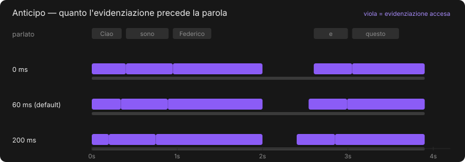
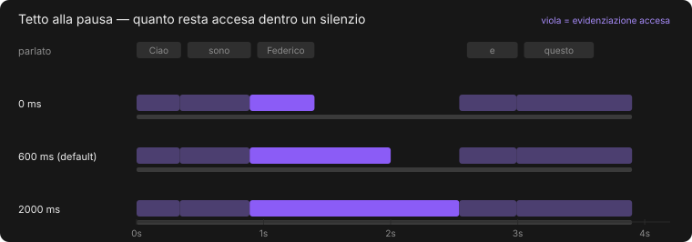
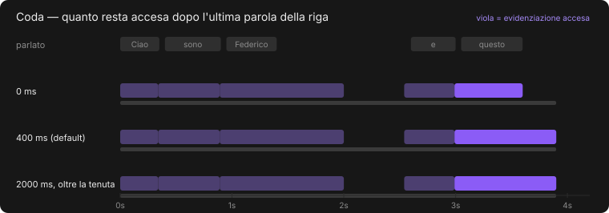

# I quattro parametri temporali

Sono quelli della scheda **Tempi**, e sono i piu' facili da fraintendere:
riguardano tutti l'evidenziazione, ma agiscono in punti diversi. Questa pagina
li spiega uno per uno, con i diagrammi di quando l'evidenziazione e'
effettivamente accesa.

Nei diagrammi la riga grigia in alto e' il **parlato**; le barre viola sono i
momenti in cui l'evidenziazione e' **accesa**; la sottile riga grigia sotto ogni
caso e' il periodo in cui la **riga di testo** e' a schermo.

Le figure sono generate da `scripts/figure_tempi.py`, che e' la traduzione riga
per riga di `calcola_finestre` in `crates/verba-core/src/layout.rs`: non sono
disegni, sono il comportamento vero.

---

## Anticipo — 0–200 ms, default 60 ms

Quanto l'evidenziazione arriva **prima** dell'inizio nominale della parola.



Sessanta millisecondi sembrano niente e cambiano tutto. Il motivo e' che
l'occhio impiega un attimo a spostarsi sulla parola: se l'evidenziazione arriva
esattamente quando la parola comincia, la si vede accendersi *dopo* averla
sentita, e sembra in ritardo. Un filo di anticipo la fa sembrare sincronizzata.

Oltre i 150 ms circa si comincia a vedere il contrario: l'evidenziazione salta
avanti prima che la parola sia pronunciata, e sembra scappare.

```bash
verba overlay intervista.m4a --anticipo 0.12
```

---

## Tetto alla pausa — 0–2000 ms, default 600 ms

Quanto l'evidenziazione resta accesa **dentro il silenzio** che segue una
parola.



Il nome non dice niente a chi non ha scritto il codice, quindi ecco cosa fa. Fra
due parole vicine l'evidenziazione passa direttamente dall'una all'altra, senza
spegnersi: e' quello che si vuole, perche' lampeggiare a ogni sillaba e'
insopportabile. Ma se dopo una parola c'e' un silenzio lungo — chi parla si
ferma, prende fiato, cerca la parola dopo — l'evidenziazione resterebbe accesa
su quella parola per tutto il silenzio, e sembrerebbe bloccata.

Questo parametro e' il tetto: **oltre questo silenzio l'evidenziazione si
spegne e resta la sola riga di testo**. Con 0 ms si spegne appena la parola
finisce e lampeggia in continuazione; con 2000 ms non si spegne quasi mai.

Nel diagramma si vede sulla terza parola, prima della pausa di 1,2 secondi.

```bash
verba overlay intervista.m4a --pausa-massima 0.3
```

---

## Coda — 0–2000 ms, default 400 ms

Quanto l'evidenziazione resta accesa dopo l'**ultima parola della riga**.



E' il caso particolare del parametro precedente: dopo l'ultima parola non c'e'
una parola successiva a cui saltare, quindi serve una regola sua. Senza coda,
l'ultima parola di ogni riga si spegne di scatto mentre la riga e' ancora a
schermo, e l'effetto e' che la riga sembra «morta» un attimo prima di sparire.

**La coda non puo' superare la tenuta della riga.** Nel terzo caso del
diagramma sono stati chiesti 2000 ms, ma la riga sparisce dopo 300 ms
(`--tenuta`) e li' finisce anche l'evidenziazione: oltre la fine della riga non
si disegna niente comunque.

```bash
verba overlay intervista.m4a --coda 0.6 --tenuta 0.8
```

---

## Durata minima parola — 20–300 ms, default 80 ms

Non riguarda l'accensione ma la **sequenza di parole**, ed e' l'unico dei
quattro che agisce prima dell'impaginazione.

L'allineatore restituisce, per ogni parola, l'intervallo in cui e' stata
pronunciata. Su articoli e preposizioni quell'intervallo puo' essere di venti o
trenta millisecondi — meno di un fotogramma a 30 fps. Una parola cosi' breve
produrrebbe un'evidenziazione che compare e sparisce nello stesso fotogramma,
cioe' un lampo.

Sotto questa soglia la durata viene portata al minimo, spostando in avanti il
confine con la parola successiva. La sequenza resta ordinata e senza
sovrapposizioni — e' una delle garanzie di `pulizia::ripulisci`, ed e' testata.

Alzarla molto (oltre i 150 ms) su un parlato veloce comincia a spostare i tempi
in modo percepibile: le parole brevi «rubano» tempo a quelle dopo.

```bash
verba trascrivi lezione.mp3 --durata-minima-parola 0.12 --out lezione.srt
```

---

## Come sono legati

```
                 durata minima parola
                 ├─ agisce sulla sequenza, prima di tutto il resto
                 │
   anticipo ─────┤  sposta indietro l'accensione
                 │
   tetto pausa ──┤  spegne dentro i silenzi
                 │
   coda ─────────┘  spegne alla fine della riga, entro la tenuta
```

Solo il primo cambia i **tempi delle parole**; gli altri tre cambiano soltanto
**quando si vede l'evidenziazione**, e si possono muovere avanti e indietro
senza rilanciare il modello — nell'applicazione si applicano entro un
fotogramma.

Un quinto parametro, `--tenuta`, non sta in questa scheda perche' riguarda la
riga e non l'evidenziazione: e' quanto la riga di testo resta a schermo dopo
l'ultima parola. La coda vive dentro la tenuta e non puo' superarla.
